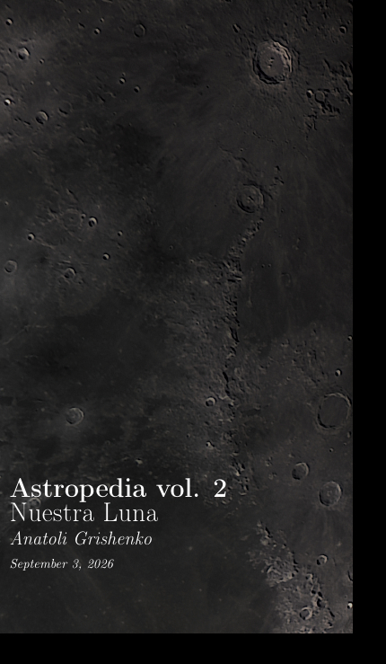
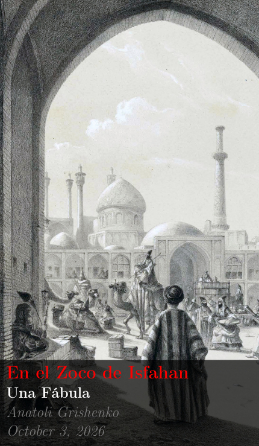
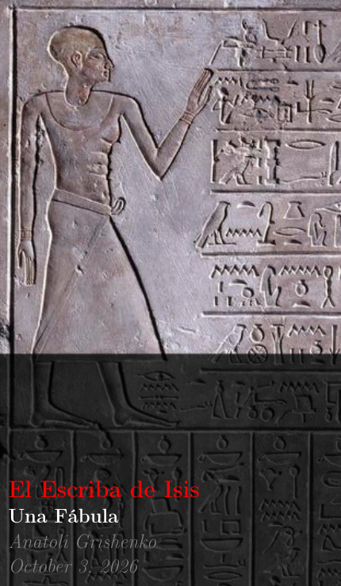

 [Fuente de la imagen](https://en.wikipedia.org/wiki/Library_of_Alexandria#/media/File:Ancientlibraryalex.jpg)

Bienvenidos a mi particular y muy personal Biblioteca de Alejandría. Aquí encontrarán archivos EPUB, PDF, JPG... cualquier formato de publicación me parece bien. Escribo sobre mis reflexiones, mi actividad de astrofotografía, mis investigaciones sobre humanismo, programación o cualquier cosa que considere que vale la pena compartir. Siéntanse como en casa y tomen lo que deseen; todo es gratuito bajo licencia Creative Commons. [Read in English](./README.md)

# Serie Astropedia

Mi actividad de astrofotografía, acompañada de algunas reflexiones personales.

| | | | |
| :---: |:---: |:---: |:---: |
| [Descargar](https://github.com/Anatoli-Grishenko/Alexandreia/releases/Descargar/The_Shelf/Supernova_ES.pdf)  40 páginas. Español.| [Descargar](https://github.com/Anatoli-Grishenko/Alexandreia/releases/Descargar/The_Shelf/Luna.pdf)  100 páginas. Español.|||

# Serie Geometría Sagrada

Un recorrido por la historia de la humanidad que muestra cómo su evolución requirió el desarrollo de algún tipo de conocimiento algebraico. Civilizaciones diferentes, incluso en extremos opuestos de la Tierra, pero con las mismas soluciones algebraicas.

## Orígenes

| | | | |
| :---: |:---: |:---: |:---: |

### Fables Sacred Geometry

Las fábulas son una especie de breve lección que transporta al lector a un lugar o época remotos de la historia, con el fin de proporcionar el contexto adecuado para los siguientes episodios de la serie.

| | | | |
| :---: |:---: |:---: |:---: |
| [Descargar](https://github.com/Anatoli-Grishenko/Alexandreia/releases/Descargar/The_Shelf/Fable_Zoco_Isfahan_ES.pdf)  16 páginas Español.| [Descargar](https://github.com/Anatoli-Grishenko/Alexandreia/releases/Descargar/The_Shelf/FableIsis_ES.pdf)  14 páginas English.|||

# Mathematical background

The formulae which describe everything

| | | | |
| :---: |:---: |:---: |:---: |
| [Descargar](https://github.com/Anatoli-Grishenko/Alexandreia/releases/Descargar/The_Shelf/Formularium_US.pdf)  60 páginas. Español.||||

# A3 Posters

| | | | |
| :---: |:---: |:---: |:---: |
| [Descargar](https://github.com/Anatoli-Grishenko/Alexandreia/releases/Descargar/The_Shelf/Galaxies_US_A3Poster.pdf)  2 A3-páginas. Español.| [Descargar](https://github.com/Anatoli-Grishenko/Alexandreia/releases/Descargar/The_Shelf/Nebulae_US_A3Poster.pdf)  6 A3-páginas. Español.| [Descargar](https://github.com/Anatoli-Grishenko/Alexandreia/releases/Descargar/The_Shelf/Stars_US_A3Poster.pdf)  3 A3-páginas. Español.||

