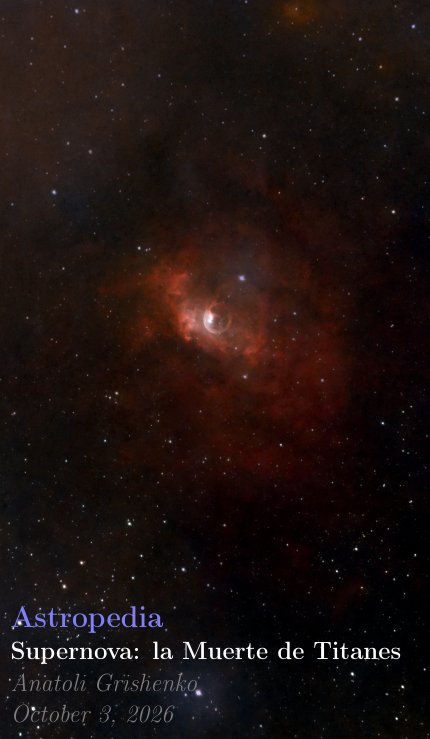

 [Fuente de la imagen](https://en.wikipedia.org/wiki/Library_of_Alexandria#/media/File:Ancientlibraryalex.jpg)

Bienvenidos a mi particular y muy personal Biblioteca de Alejandría. Aquí encontrarán archivos EPUB, PDF, JPG... cualquier formato de publicación me parece bien. Escribo sobre mis reflexiones, mi actividad de astrofotografía, mis investigaciones sobre humanismo, programación o cualquier cosa que considere que vale la pena compartir. Siéntanse como en casa y tomen lo que deseen; todo es gratuito bajo licencia Creative Commons. [Read in Spanish]{./README.md)

# Serie Astropedia

Mi actividad de astrofotografía, acompañada de algunas reflexiones personales.

| | | | |
| :---: |:---: |:---: |:---: |
| [Download](https://github.com/Anatoli-Grishenko/Alexandreia/releases/download/The_Shelf/Supernova_ES.pdf)  40 Pages. Spanish.| [Download](https://github.com/Anatoli-Grishenko/Alexandreia/releases/download/The_Shelf/OurMoon_US.pdf)  100 Pages. Spanish.|||

# Serie Geometría Sagrada

Un recorrido por la historia de la humanidad que muestra cómo su evolución requirió el desarrollo de algún tipo de conocimiento algebraico. Civilizaciones diferentes, incluso en extremos opuestos de la Tierra, pero con las mismas soluciones algebraicas.

## Orígener

| | | | |
| :---: |:---: |:---: |:---: |
| [Download](https://github.com/Anatoli-Grishenko/Alexandreia/releases/download/The_Shelf/Civilizations_US.pdf)  40 Pages. Spanish.| [Download](https://github.com/Anatoli-Grishenko/Alexandreia/releases/download/The_Shelf/RisingSapiens_US.pdf)  34 Pages. Spanish.| [Download](https://github.com/Anatoli-Grishenko/Alexandreia/releases/download/The_Shelf/TheEpiphany_US.pdf)  41 Pages. Spanish.||

### Fables Sacred Geometry

Fables are kind of a tiny lecture which transport the reader to an ancient place or time in History in order to provide a proper context for the upcoming episodes of the series.

| | | | |
| :---: |:---: |:---: |:---: |
| [Download](https://github.com/Anatoli-Grishenko/Alexandreia/releases/download/The_Shelf/Fable_Zoco_Isfahan_US.pdf)  16 pages Spanish.||||

# Mathematical background

The formulae which describe everything

| | | | |
| :---: |:---: |:---: |:---: |
| [Download](https://github.com/Anatoli-Grishenko/Alexandreia/releases/download/The_Shelf/Formularium_US.pdf)  60 Pages. Spanish.||||

# A3 Posters

| | | | |
| :---: |:---: |:---: |:---: |
| [Download](https://github.com/Anatoli-Grishenko/Alexandreia/releases/download/The_Shelf/Galaxies_US_A3Poster.pdf)  2 A3-Pages. Spanish.| [Download](https://github.com/Anatoli-Grishenko/Alexandreia/releases/download/The_Shelf/Nebulae_US_A3Poster.pdf)  6 A3-Pages. Spanish.| [Download](https://github.com/Anatoli-Grishenko/Alexandreia/releases/download/The_Shelf/Stars_US_A3Poster.pdf)  3 A3-Pages. Spanish.||

