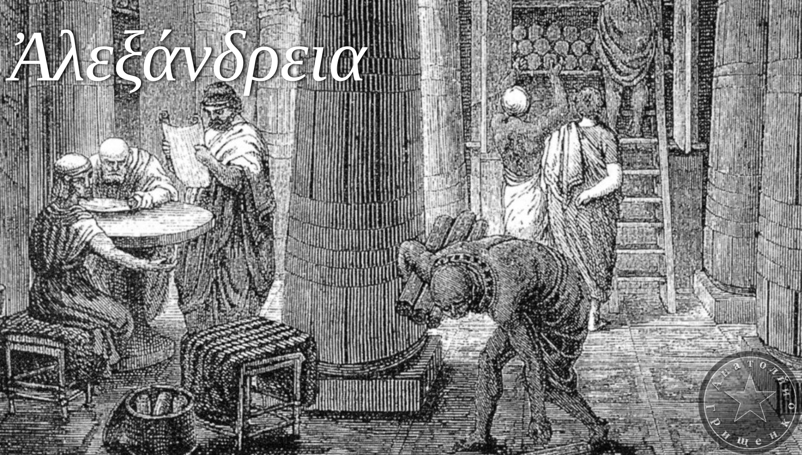
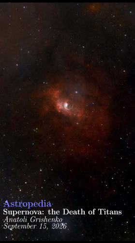

Welcome to my particular, and very personal, Library of Alexandria. I will leave here EPUBs, PDFs, JPGs, ... whatever publication means is fine to me. I write about my thoughts, my Astrophotography activity, my research on Humanism, code, or whatever I connsider worth sharing. Please feel yourself at home and take whatever you want. Everything is free under Creative Commons Licence.

# Astropedia Series

My astrophotography activity dressed with some personal thoughts

 [Download](https://github.com/Anatoli-Grishenko/Alexandreia/releases/download/The_Shelf/SuperNova_US_EBook.pdf) 62 Pages. English.

# Sacred Geometry Series

A journey for the history of the human beigns which show how its evolution required the development of some sort of algebraic knowledge. Different civilizations, even in opposite sides of Earth, but same algebraic solutions.

