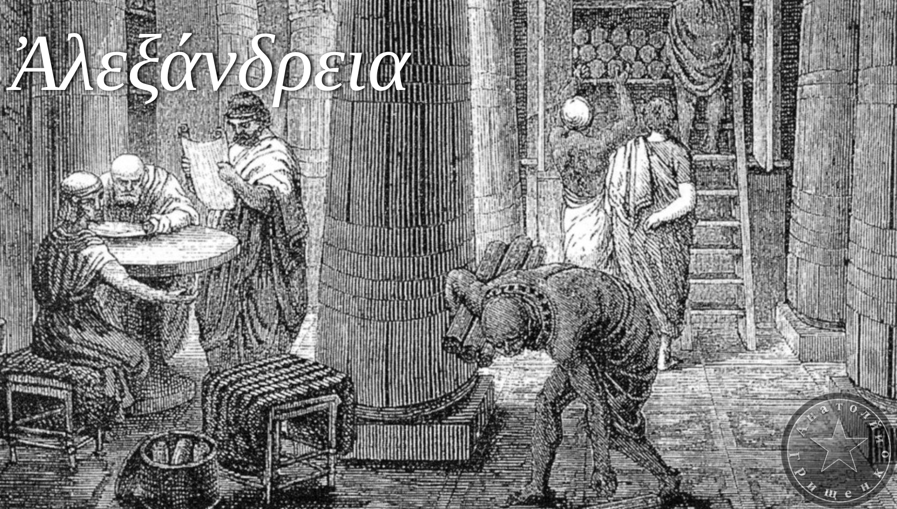 [Image Credits](https://en.wikipedia.org/wiki/Library_of_Alexandria#/media/File:Ancientlibraryalex.jpg)

Welcome to my particular, and very personal, Library of Alexandria. I will leave here EPUBs, PDFs, JPGs, ... whatever publication means is fine to me. I write about my thoughts, my Astrophotography activity, my research on Humanism, code, or whatever I connsider worth sharing. Please feel yourself at home and take whatever you want. Everything is free under Creative Commons Licence. [Leer en Español](./LEEME.md)

# Astropedia Series

My astrophotography activity dressed with some personal thoughts.

| | | | |
| :---: |:---: |:---: |:---: |
|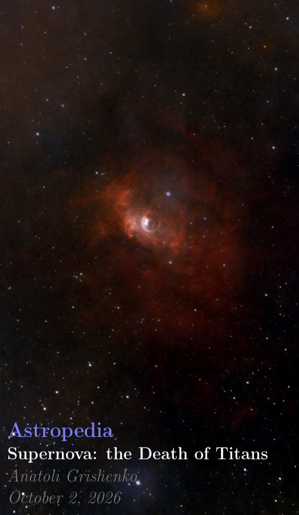 [Download](https://github.com/Anatoli-Grishenko/Alexandreia/releases/download/The_Shelf/Supernova_US.pdf)  40 Pages. English.|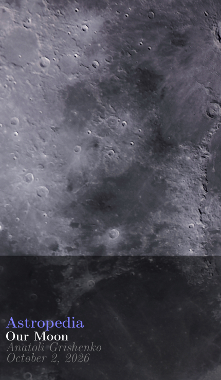 [Download](https://github.com/Anatoli-Grishenko/Alexandreia/releases/download/The_Shelf/OurMoon_US.pdf)  100 Pages. English.|||

# Sacred Geometry Series

A journey for the history of the human beings which show how its evolution required the development of some sort of algebraic knowledge. Different civilizations, even in opposite sides of Earth, but same algebraic solutions.

## Origins

| | | | |
| :---: |:---: |:---: |:---: |
|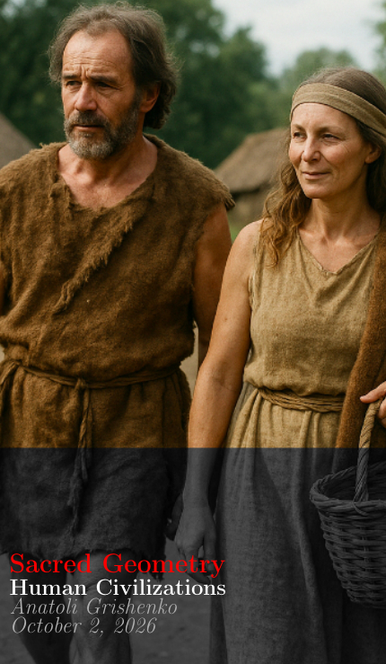 [Download](https://github.com/Anatoli-Grishenko/Alexandreia/releases/download/The_Shelf/Civilizations_US.pdf)  40 Pages. English.|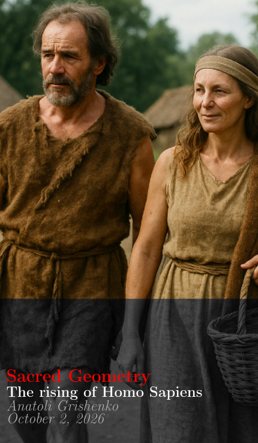 [Download](https://github.com/Anatoli-Grishenko/Alexandreia/releases/download/The_Shelf/RisingSapiens_US.pdf)  34 Pages. English.|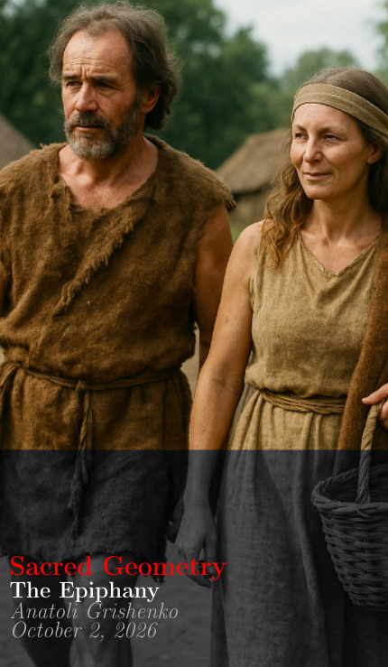 [Download](https://github.com/Anatoli-Grishenko/Alexandreia/releases/download/The_Shelf/TheEpiphany_US.pdf)  41 Pages. English.||

### Fables Sacred Geometry

Fables are kind of a tiny lecture which transport the reader to an ancient place or time in History in order to provide a proper context for the upcoming episodes of the series.

| | | | |
| :---: |:---: |:---: |:---: |
|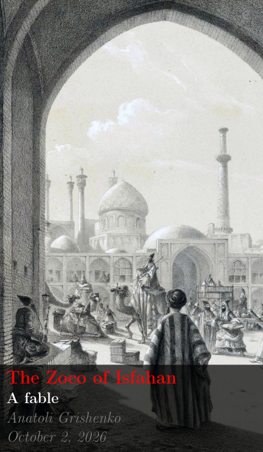 [Download](https://github.com/Anatoli-Grishenko/Alexandreia/releases/download/The_Shelf/Fable_Zoco_Isfahan_US.pdf)  16 pages English.|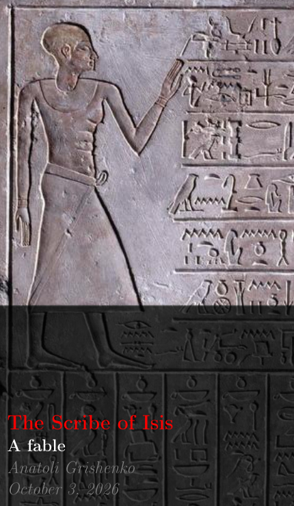 [Download](https://github.com/Anatoli-Grishenko/Alexandreia/releases/download/The_Shelf/FableIsis_US.pdf)  14 pages English.|||

# Mathematical background

The formulae which describe everything

| | | | |
| :---: |:---: |:---: |:---: |
|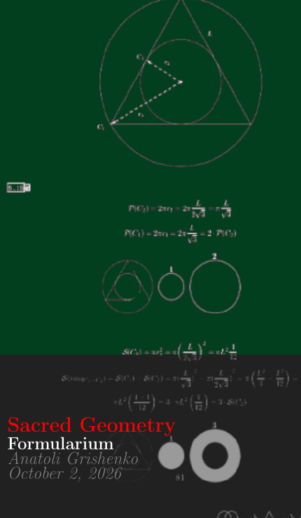 [Download](https://github.com/Anatoli-Grishenko/Alexandreia/releases/download/The_Shelf/Formularium_US.pdf)  60 Pages. English.||||

# A3 Posters

| | | | |
| :---: |:---: |:---: |:---: |
|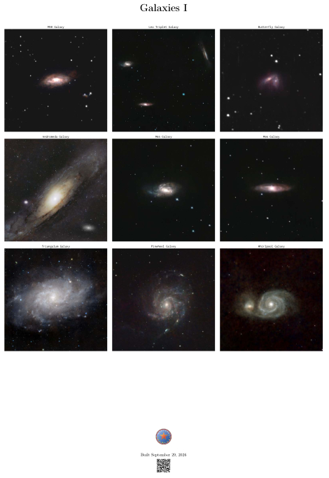 [Download](https://github.com/Anatoli-Grishenko/Alexandreia/releases/download/The_Shelf/Galaxies_US_A3Poster.pdf)  2 A3-Pages. English.|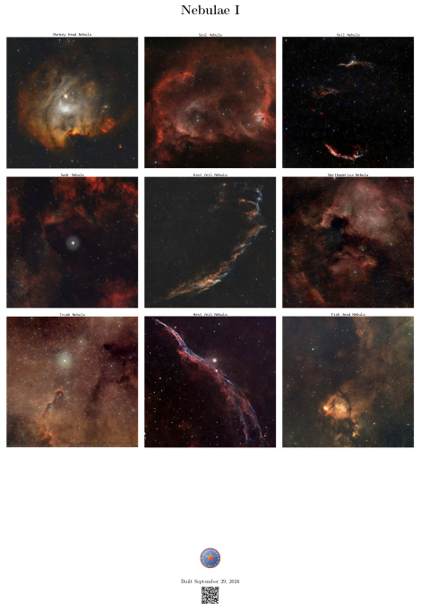 [Download](https://github.com/Anatoli-Grishenko/Alexandreia/releases/download/The_Shelf/Nebulae_US_A3Poster.pdf)  6 A3-Pages. English.|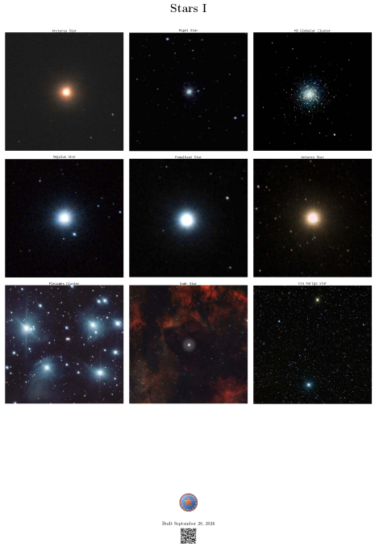 [Download](https://github.com/Anatoli-Grishenko/Alexandreia/releases/download/The_Shelf/Stars_US_A3Poster.pdf)  3 A3-Pages. English.||

